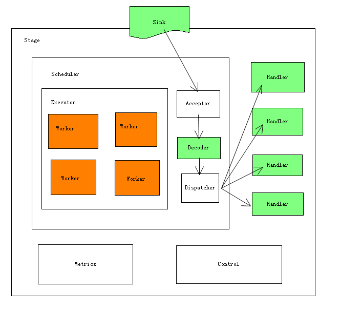
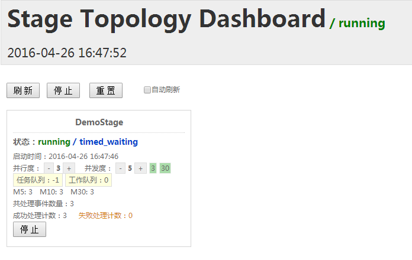

# SEDA Java implementation --- racing

### java实现的 **seda** 架构
> Stage组成：调度器，执行器，工作单元，接收者，分发者，控制器，性能监控，事件处理器



* 与spring-boot完美集成，简单易用
* 核心实现不依赖任何容器，可随意在各种项目中集成
* 依赖 java8


### 集群拓扑结构管理

* 项目依赖 `racing-boot` 子项目
* 管理地址：http://localhost:8080/

### 使用指南
首先明确业务逻辑可划分为多个`Stage`，每个Stage负责一个逻辑计算，相互之间用消息队列传递消息。

在实现Stage时，需要实现三大组件（在架构图中以绿色背景标出）

1. `Sink` 输入队列
2. `Decoder` 消息解码器
3. `Handler` 事件处理器

> 详细使用参考 racing-demo 子项目

```java
@Component
public class DemoStage extends Stage<String> {

    private ArrayList<Handler<String>> outputHandlers = Lists.newArrayList();

    public DemoStage() {
        super("DemoStage");
        outputHandlers.add(new OutputHandler<String>());
    }

    @PostConstruct
    public void init() {
        setSink(new UuidSink(2000));
        setDecoder(new StringDecoder());
        setHandlers(outputHandlers);
    }
}

```

### SEDA 架构思想
> [Matthew David Welsh--An Architecture for Highly Concurrent](http://www.eecs.harvard.edu/~mdw/papers/mdw-phdthesis.pdf)

> SEDA将应用分为若干由事件队列链接的网状Stage，从而形成一个系统计算拓扑。

`2016-4-27 16:40`